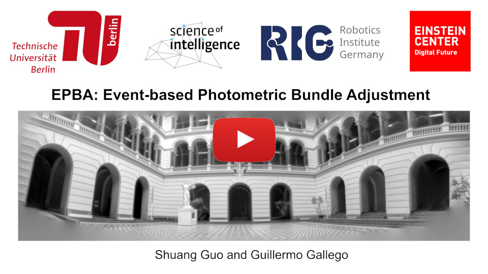

# EPBA: Event-based Photometric Bundle Adjustment
Official repository for [**Event-based Photometric Bundle Adjustment**](https://doi.org/10.1109/TPAMI.2025.3586497), by [Shuang Guo](https://shuang1997.github.io) and [Guillermo Gallego](http://www.guillermogallego.es).
<h2 align="left">

[PDF](https://arxiv.org/pdf/2412.14111) | [Video](https://youtu.be/v4DhU-N6o6s) | [Dataset](https://github.com/tub-rip/ECRot) 
</h2>

[](https://youtu.be/v4DhU-N6o6s)

## Citation

If you use this work in your research, please cite it as follows:

```bibtex
@Article{Guo25tpmai,
  author        = {Shuang Guo and Guillermo Gallego},
  title         = {Event-based Photometric Bundle Adjustment},
  journal       = {IEEE Trans. Pattern Anal. Mach. Intell. (T-PAMI)},
  year          = 2025,
  doi           = {10.1109/TPAMI.2025.3586497}
}
```

# Code coming soon... 
<!-- ------- -->
## Setup

### High-level Input-Output

**Input**:
- Events.
- Camera calibration.
- Initial trajectory from other front-end methods.
- (Optional) Initial panoramic brightness maps.

**Output**:
- Refined rotations of the event camera.
- Refined intensity panorama.

## Usage
- [Installation](docs/installation.md)
- [Execution](docs/execution.md)
- [Parameter Guide](docs/parameters.md)

## [Event Camera Rotation Dataset (ECRot)](https://github.com/tub-rip/ECRot)

We test EPBA on the newly-released ECRot dataset, see and download it at [here](https://github.com/tub-rip/ECRot). The instructions of running EPBA on the ECRot dataset can be found [here](docs/execution.md).

## Acknowledgements

This code leverages the following repository for computing the derivative of Lie Group B-splines:
- [Basalt Headers](https://gitlab.com/VladyslavUsenko/basalt-headers)


## Additional Resources


* [Research page (TU Berlin RIP lab)](https://sites.google.com/view/guillermogallego/research/event-based-vision)
* [Course at TU Berlin](https://sites.google.com/view/guillermogallego/teaching/event-based-robot-vision)
* [CMax-SLAM (TRO 2024)](https://github.com/tub-rip/cmax_slam)
* [EMBA: Event-based Mosaicing Bundle Adjustment (ECCV 2024)](https://github.com/tub-rip/emba)
* [Secrets of Event-Based Optical Flow (TPAMI 2024)](https://github.com/tub-rip/event_based_optical_flow)
* [ES-PTAM: Event-based Stereo Parallel Tracking and Mapping](https://github.com/tub-rip/ES-PTAM)
* [Survey paper](http://rpg.ifi.uzh.ch/docs/EventVisionSurvey.pdf)
* [List of Resources](https://github.com/uzh-rpg/event-based_vision_resources)
